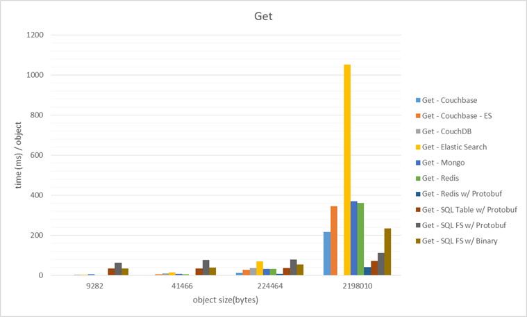
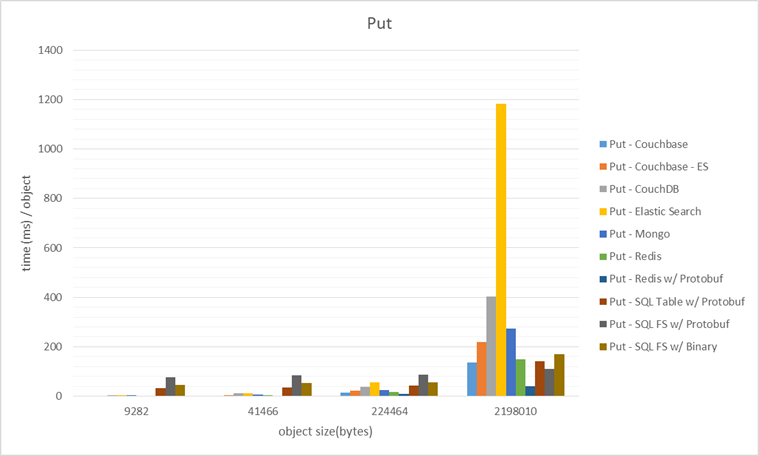

README
========

Persistence Latency Benchmark

This is a standard and personal latency benchmark of Get & Put operations on POCO C# objects against the different permutations of common durable stores and serialization techniques.
Note the interesting behavior as complexity of the objects increase.

Included "databases" in this benchmark:
- CouchDB
- MongoDB
- Redis
- SQLServer Filestream

Included serialization techniques:
- .NET BinaryFormatter
- Google Protocol Buffers

Note that the following operations are run on a local laptop and averaged over 10 runs.
All "databases" are setup on the same laptop to mitigate network latency between nodes.

This benchmark is in no way a formal comparison/benchmark.
This benchmark only provides comparison of the latency aspect of this serialization and persistence.

This benchmark does not represent the use-case of a system under heavy load.
There are way more advantages and disadvantages of each technology involved not covered in this benchmark.

**Get** Operations

**Put** Operations

~samtj