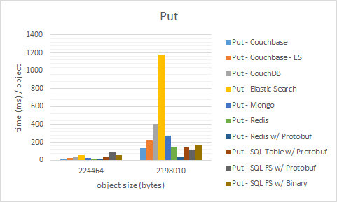

README
========

Persistence Latency Benchmark

This is a standard and personal latency benchmark of Get & Put operations on POCO C# objects against the different permutations of common durable stores and serialization techniques.
Note the interesting behavior as complexity of the objects increase.

Included "data stores" in this benchmark:
- CouchDB
- MongoDB
- Redis
- Couchbase
- Elastic Search
- Couchbase w/ Replication to Elastic Search
- SQLServer Filestream
- SQLServer Table Storage

Included serialization techniques:
- .NET BinaryFormatter
- Google Protocol Buffers
- Json.NET by Newtonsoft

Note that the following operations are run on a local Windows 7 laptop and averaged over 5 sets of 20 runs each.
All "data stores" are setup on the same laptop to mitigate network latency between nodes.

This benchmark is in no way a formal comparison/benchmark.
This benchmark only provides comparison of the latency aspect of serialization and persistence.
This benchmark assumes the use-case of a simple Key-Value store. Object ID is assumed to be a unique key and the key is used to retrieve that particular object from the store.
This benchmark also does not represent the use-case of a system/store under heavy load or in the event of nodes failure as well as node partitioning.

For Put operations, time captured includes serialization from a particular C# POCO and persistence into the store.
For Get operations, time captured includes query from the store and deserialization from persisted stream (binary, Json, etc) into C# POCO representation.

There are way more advantages and disadvantages of each technology involved not covered in this benchmark.

For example: Elastic Search provides way more flexibility in terms of searching and locating documents by indexes using Lucene.
However, it does so at a cost that is not covered here.

**Get** Operations

**Put** Operations

There is no free lunch.

~samtj